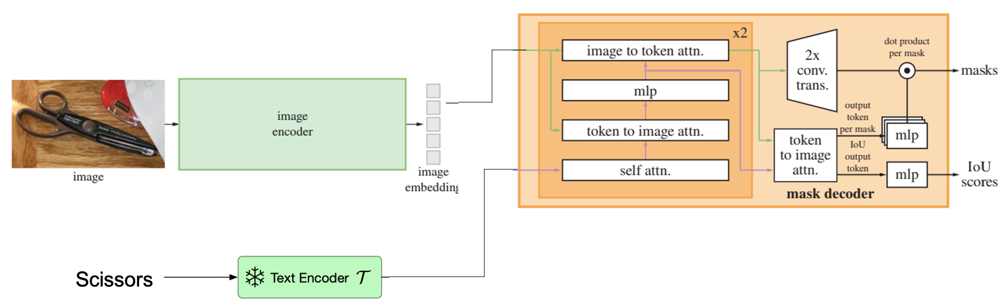

# ReferSAM
The official PyTorch implementation of SAM model for refering image segmentation(RIS).

## Framework
More details([SAM](https://github.com/facebookresearch/segment-anything) )

  

## Preparation

1. Environment
   - refer to [SAM](https://github.com/facebookresearch/segment-anything)
2. Datasets
   - The detailed instruction is in [LAVT](https://github.com/yz93/LAVT-RIS).
3. Pretrained weights
   - refer to [SAM](https://github.com/facebookresearch/segment-anything)

## Train and Test

Refer to [LAVT](https://github.com/yz93/LAVT-RIS).

## License

This project is under the MIT license. See [LICENSE](LICENSE) for details.

Some code changes come from [SAM](https://github.com/facebookresearch/segment-anything) and [LAVT](https://github.com/yz93/LAVT-RIS).
